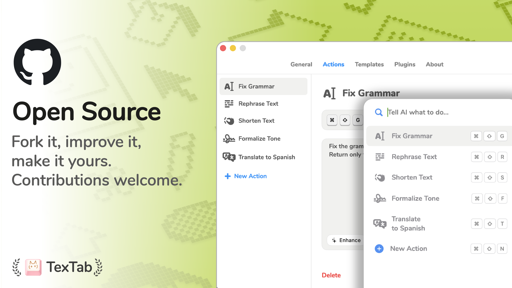

<p align="center">
  
</p>

<h1 align="center">ShortcutAI</h1>

<p align="center">Turn any AI task into a keyboard shortcut.</p>

<p align="center">
  <a href="https://github.com/Torutesu/shortcutai">Repository</a> · <a href="https://github.com/Torutesu/shortcutai/issues">Issues</a> · <a href="https://github.com/Torutesu/shortcutai/discussions">Discussions</a>
</p>

<br />

<p align="center">
  
</p>

<br />

## About

ShortcutAI is a desktop app (macOS release + Windows preview) that lets you trigger AI-powered text actions with a keyboard shortcut. Select text in any app, press your shortcut, pick an action — done.

Your API key, your model. No subscriptions, no middlemen.

## Platform Support

- macOS: supported today
- Windows: preview scaffold available in `apps/windows` (Tauri + React)

## Windows Roadmap

1. Split platform-agnostic logic (AI actions, prompt engine, logs) into a shared core module.
2. Build a Windows client (recommended: Tauri + React or .NET MAUI) using the same core behavior.
3. Implement Windows global shortcut + selected text capture + safe paste flow.
4. Ship public beta, then parity release with macOS core features.

<br />

<p align="center">
  
</p>

<br />

## Features

- **Custom actions** — create unlimited prompts, each with its own shortcut
- **Multiple providers** — OpenAI, Claude, Groq, OpenRouter, Perplexity
- **Plugins** — Chat, QR Generator, Image Converter, Color Picker
- **Privacy first** — your API key talks directly to the provider
- **Works everywhere** — any app, any text field

<br />

<p align="center">
  
</p>

<br />

## Getting started

```bash
git clone https://github.com/Torutesu/shortcutai.git
```

1. Open `typo/typo.xcodeproj` in Xcode
2. Copy the secrets template:
   ```bash
   cp Secrets.example.swift typo/typo/Secrets.swift
   ```
3. Fill in your values in `Secrets.swift` (gitignored)
4. Add `Secrets.swift` to the Xcode target
5. Build and run (`Cmd+R`)

### Requirements

- macOS 13+
- Xcode 15+
- An AI provider API key (OpenAI, Anthropic, etc.)

### Windows preview

```bash
cd apps/windows
npm install
npm run dev
```

To run the desktop preview with Tauri:

```bash
cd apps/windows
npm install
npm run tauri:dev
```

<br />

## Contributing

Fork it, improve it, make it yours. PRs welcome.

## License

GPL v3 — see [LICENSE](LICENSE).
